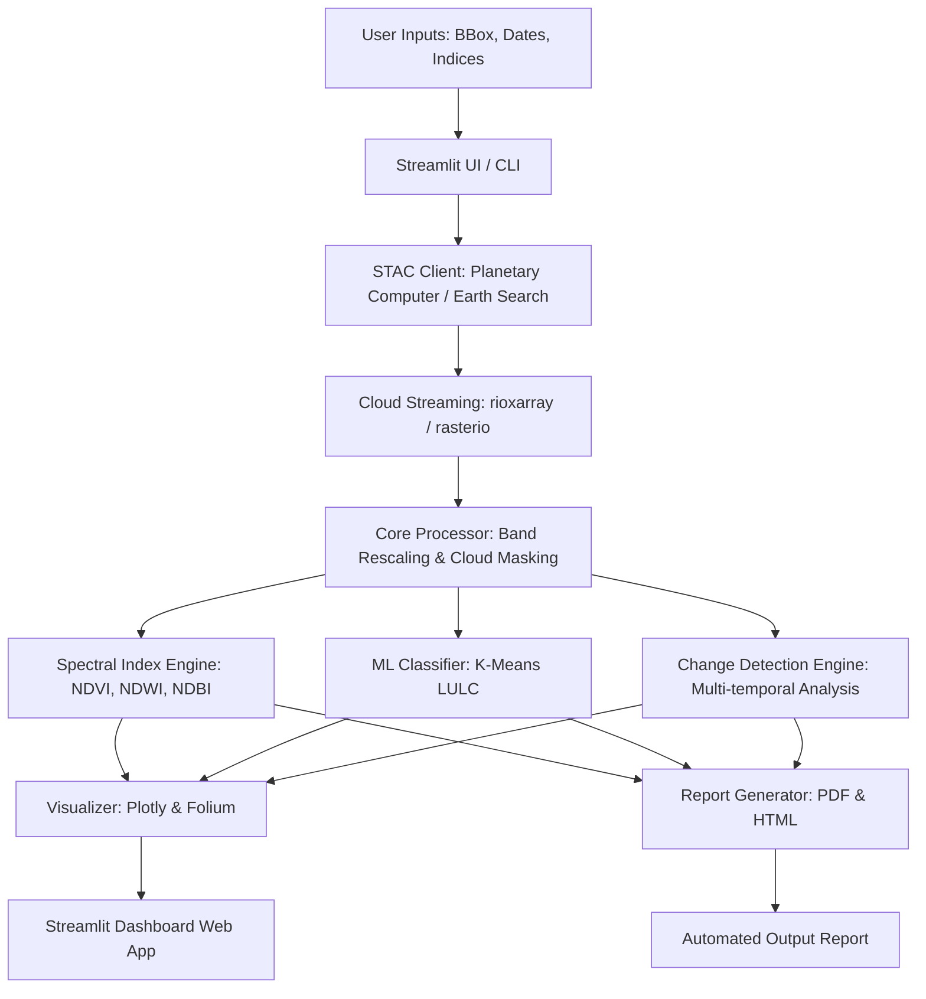

# Implementation Plan: Automated Satellite Image Processing Pipeline (ASIPP)

The **Automated Satellite Image Processing Pipeline (ASIPP)** is a professional-grade, cloud-native Earth Observation (EO) data science pipeline. It is designed to demonstrate advanced spatial analysis, machine learning classification, automation, and interactive web dashboard development—making it a perfect centerpiece for a geospatial portfolio.

---

## 🎯 Portfolio Objectives
1. **Highlight Cloud-Native GIS**: Move away from heavy local file downloads by leveraging **STAC (SpatioTemporal Asset Catalog)** APIs and **COGs (Cloud-Optimized GeoTIFFs)** to query and stream only the specific bands and sub-regions needed.
2. **Demonstrate Automation & Scale**: Build both a **robust CLI** for batch automated runs and a **premium interactive Streamlit app** for user-friendly exploration.
3. **Incorporate ML & Geospatial Analytics**: Perform unsupervised land cover classification (LULC), spectral index computation (NDVI, NDWI, NDBI), and change detection (e.g., flood impact, urban growth).
4. **Professional Reporting**: Auto-generate dynamic PDF/HTML reports detailing analysis results and maps.

---

## 🛠️ Architecture & Tech Stack



### 📦 Key Python Libraries
- **Geospatial & IO**: `rasterio`, `rioxarray`, `geopandas`, `shapely`, `pyproj`, `pystac-client`, `odc-stac`
- **Data Science & ML**: `numpy`, `pandas`, `scikit-learn`, `scipy`
- **Visualization**: `matplotlib`, `plotly`, `folium`, `streamlit-folium`
- **Frontend**: `streamlit`
- **Reporting**: `jinja2`, `pdfkit` or `fpdf`

---

## 📁 Proposed Project Structure

```
Automated Satellite Image Processing Pipeline/
├── README.md                      # 📖 Main documentation & Portfolio Showcase
├── IMPLEMENTATION_PLAN.md         # 📝 This implementation guide
├── app.py                         # 🌐 Premium Streamlit Web Application
├── main.py                        # 💻 Production CLI Pipeline
├── requirements.txt               # 📋 Python Dependencies
├── src/                           # ⚙️ Core Pipeline Source Code
│   ├── __init__.py
│   ├── config.py                  # App configuration & constants
│   ├── stac_client.py             # STAC API client for Earth Search/Planetary Computer
│   ├── processor.py               # Raster calibration, cloud masking & indices (NDVI, NDWI, etc.)
│   ├── classifier.py              # ML Land Use/Land Cover (LULC) Classifier (K-Means/GMM)
│   ├── change_detector.py         # Multi-temporal raster change analysis
│   ├── report_generator.py        # PDF & HTML automated report creation
│   └── utils.py                   # Bounding box utilities, conversions, coordinate transforms
├── data/                          # 📁 Data storage
│   ├── raw/                       # Cached/Downloaded raw bands
│   ├── processed/                 # Computed indices and classified rasters (GeoTIFF)
│   └── geojson/                   # Region geometries (e.g., Lahore, Gilgit, Karachi)
└── output/                        # 📁 Visualizations & PDF reports
    ├── figures/
    └── reports/
```

---

## 🚀 Step-by-Step Implementation Phases

### 🔹 Phase 1: Environment & STAC Infrastructure
- **Action**: Setup `requirements.txt`, core directory structures, and configure `stac_client.py`.
- **Details**: Implement connection to Element 84's `earth-search` STAC endpoint (or Planetary Computer) using `pystac-client`. Query Sentinel-2 Level-2A imagery by bounding box, date range, and maximum cloud cover (< 10%). Stream sub-regions using windowed reads in `rioxarray` to save bandwidth.
- **Fallback**: Provide a high-fidelity local raster generator that synthesizes realistic Landsat/Sentinel bands for the selected area if the API goes offline or fails.

### 🔹 Phase 2: Processing & Spectral Indices
- **Action**: Build `processor.py` to process the streaming bands.
- **Details**:
  - Rescale digital numbers (DN) to Surface Reflectance (SR).
  - Compute:
    - **NDVI** (Normalized Difference Vegetation Index): `(B08 - B04) / (B08 + B04)`
    - **NDWI** (Normalized Difference Water Index): `(B03 - B08) / (B03 + B08)`
    - **NDBI** (Normalized Difference Build-Up Index): `(B11 - B08) / (B11 + B08)`
  - Run automated cloud masking using the Scene Classification Layer (SCL) band or QA mask.

### 🔹 Phase 3: Machine Learning Land Cover Classification
- **Action**: Build `classifier.py` for automated segmentation.
- **Details**:
  - Stack the spectral indices (NDVI, NDWI, NDBI) and raw bands (R, G, B, NIR).
  - Use `scikit-learn`'s `KMeans` or Gaussian Mixture Models (GMM) to segment the area into 4 distinct classes: Water, Dense Vegetation, Urban/Built-up, and Bare Soil.
  - Automatically map cluster numbers to human-readable classes based on mean cluster indices (e.g., the cluster with highest NDVI is labeled "Vegetation", highest NDWI is "Water").

### 🔹 Phase 4: Change Detection Engine
- **Action**: Implement multi-temporal comparisons in `change_detector.py`.
- **Details**: Take two datasets (e.g., Year 2020 vs Year 2025) and calculate spatial change. Quantify urban expansion (gains in NDBI/Urban class) or vegetation health decline (declines in NDVI).

### 🔹 Phase 5: Interactive Web Dashboard & CLI
- **Action**: Create `app.py` using Streamlit and `main.py` for CLI.
- **Details**:
  - Build a sleek, modern Streamlit UI with a custom dark theme, sidebar configuration, map visualizer showing interactive side-by-side maps of indices, and Plotly analytics.
  - Enable PDF report export including the analysis tables, charts, and maps.
  - Implement the CLI tool using `argparse` to allow developers to run the pipeline headless.

---

## 📈 Portfolio Wow-Factors
- **Modern STAC Streaming**: Demonstrates that you don't just download files; you write cloud-native code.
- **Automated Labeling**: Our classification algorithm will automatically assign meaning to unsupervised clusters (Water, Vegetation, Urban, Soil) by analyzing cluster centroids, proving intelligent engineering.
- **High-End Design**: The dashboard will feature glassmorphism, responsive controls, and high-quality charts that will stand out to recruiters and academic boards.
