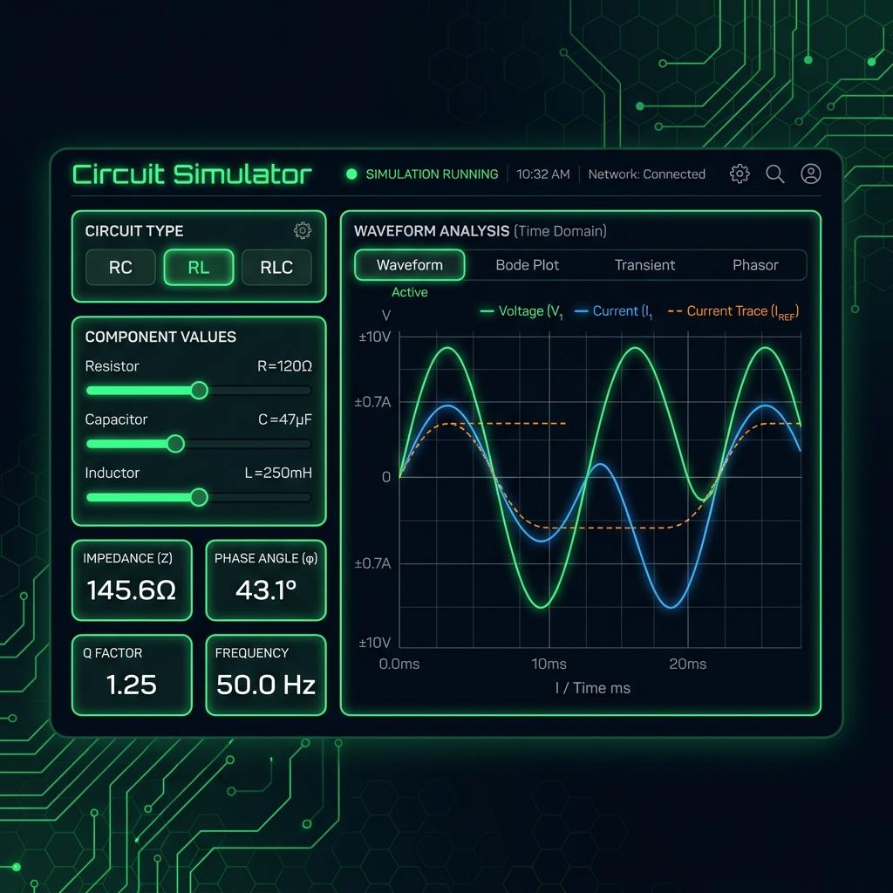

# ⚡ Circuit Simulator Dashboard

> **Project 8.1 — Electronics Engineering Portfolio**
> *Interactive RC · RL · RLC Circuit Simulator with Real-Time Waveform Analysis*

[]()
[]()
[]()
[]()

---



## 🔬 Overview

A **premium, browser-based circuit simulation dashboard** that models RC, RL, and RLC circuits in real-time. No backend required — open `index.html` and it runs instantly. Features an oscilloscope-style interface, live phasor diagrams, Bode plots, and transient response analysis.

---

## 🚀 Features

| Feature | Description |
|---|---|
| **Circuit Types** | RC · RL · RLC (Series & Parallel) |
| **Waveform View** | Time-domain Vs(t), VR(t), and I(t) with live updates |
| **Bode Plot** | Log-frequency magnitude & phase response |
| **Transient Analysis** | Step response: capacitor charging, inductor kickback, RLC oscillation |
| **Phasor Diagram** | Rotating vector diagram with phase angle annotation |
| **Live Metrics** | Z, φ, f₀, Q, Irms, VR, τ, BW, Power Factor, True Power |
| **SVG Schematic** | Auto-rendered circuit diagram that updates with selections |
| **Export CSV** | Download waveform data for post-processing |

---

## 🎛️ How to Use

```bash
# No installation needed — just open in a browser
open index.html
```

1. **Select** your circuit type: `RC`, `RL`, or `RLC`
2. **Choose** topology: `Series` or `Parallel`
3. **Tune** component values with sliders (R, C, L, Vs, frequency)
4. **Explore** the four analysis tabs: Waveform · Bode · Transient · Phasor
5. **Export** waveform data as `.csv` for further analysis

---

## 🔢 Physics Behind It

### Impedance
```
Series:    Z = R + j(ωL - 1/ωC)    |Z| = √(R² + X²)
Parallel:  Y = 1/R + jωC - j/ωL   Z = 1/Y
```

### Resonance (RLC)
```
f₀ = 1 / (2π√(LC))
Q_series   = (1/R) · √(L/C)
Q_parallel = R · √(C/L)
Bandwidth  = f₀ / Q
```

### Transient (RC step response)
```
Vc(t) = Vs · (1 − e^{−t/τ})    τ = RC
```

### Transient (RLC underdamped)
```
Vc(t) = Vs · [1 − e^{−αt}(cos ωd·t + (α/ωd)·sin ωd·t)]
α = R/2L,  ωd = √(ω₀² − α²)
```

---

## 🛠️ Tech Stack

| Tool | Role |
|------|------|
| HTML5 + CSS3 | Layout, animations, glassmorphism UI |
| Vanilla JavaScript | Simulation engine, real-time math |
| Chart.js 4 | Waveform, Bode, Transient plots |
| SVG | Dynamic circuit schematic rendering |
| Google Fonts | Orbitron + Inter + JetBrains Mono |

---

## 📊 Key Learning Outcomes

- ✅ AC circuit analysis (impedance, phase angle, power factor)
- ✅ Transient response (charging/discharging, oscillation)
- ✅ Frequency domain analysis (Bode magnitude & phase)
- ✅ Phasor representation of AC quantities
- ✅ RLC resonance, Q-factor, and bandwidth relationships

---

## 👨‍💻 Author

**Haris Hussain**
Space Science · University of the Punjab, Lahore
Electronics Engineering Portfolio — Project 8.1
