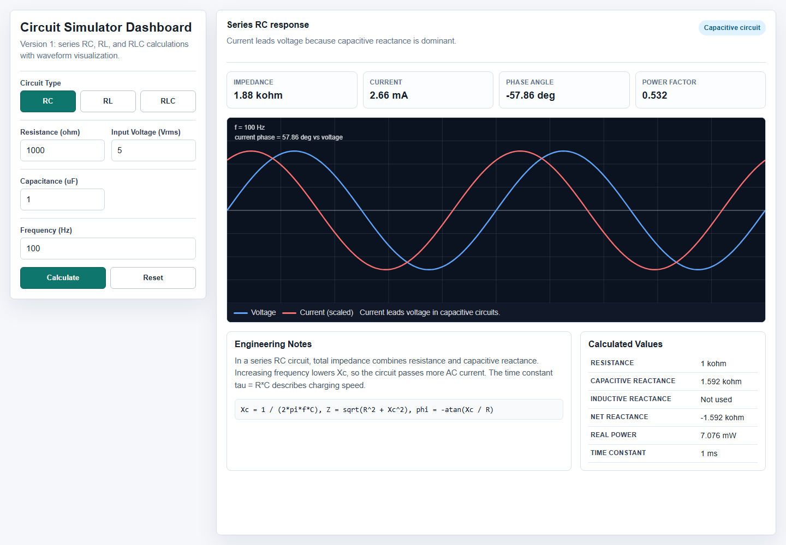

# Circuit Simulator Dashboard

Status: **Version 1 complete**

## Purpose

Build a simple, honest circuit theory project that demonstrates entry-level understanding of RC, RL, and RLC circuits. This is one of the strongest first projects in the electronics portfolio because it directly shows electrical fundamentals.

## Engineering Skills To Show

- Ohm's law and impedance
- Capacitor and inductor behavior
- RC charging and discharging
- RL current growth and decay
- RLC resonance and damping
- Phase angle and frequency response
- Clean graph-based explanation of circuit behavior

## Version 1 Features

- Select RC, RL, or RLC series circuit
- Enter resistance, capacitance, inductance, input voltage, and frequency
- Calculate impedance, current, phase angle, power factor, and real power
- Plot voltage and current waveforms on a canvas
- Show RC/RL time constant where relevant
- Show RLC resonant frequency and near-resonance status
- Explain the engineering formula used for each circuit type

## How To Run

Open `index.html` in a modern browser.

No installation, backend, package manager, or internet connection is required.

## Preview



## Evidence To Capture

- Screenshot of the dashboard
- Example calculation for one RC circuit
- Example calculation for one RLC circuit
- Short note comparing expected theory with output

## Test Examples

### RC Example

Inputs:

- R = 1000 ohm
- C = 1 uF
- V = 5 Vrms
- f = 100 Hz

Expected behavior:

- Capacitive reactance is about 1.59 kohm
- Total impedance is about 1.88 kohm
- Current leads voltage
- Time constant is 1 ms

### RLC Example

Inputs:

- R = 1000 ohm
- L = 100 mH
- C = 1 uF
- V = 5 Vrms
- f = 503 Hz

Expected behavior:

- Resonant frequency is close to 503 Hz
- Net reactance is close to zero
- Current is almost in phase with voltage

## Entry-Level Job Value

This project supports applications for electronics technician trainee, junior electrical engineer, and lab assistant roles. It shows that I can explain the basic behavior of passive circuits and convert theory into a usable tool.

## Current Files

```text
Circuit Simulator Dashboard/
|-- README.md
|-- index.html
|-- screenshot-v1.png
```

## Next Step

Add screenshots and a `test-cases.md` file after visual review. A later version can add transient response plots for capacitor charging, inductor current growth, and underdamped RLC response.
