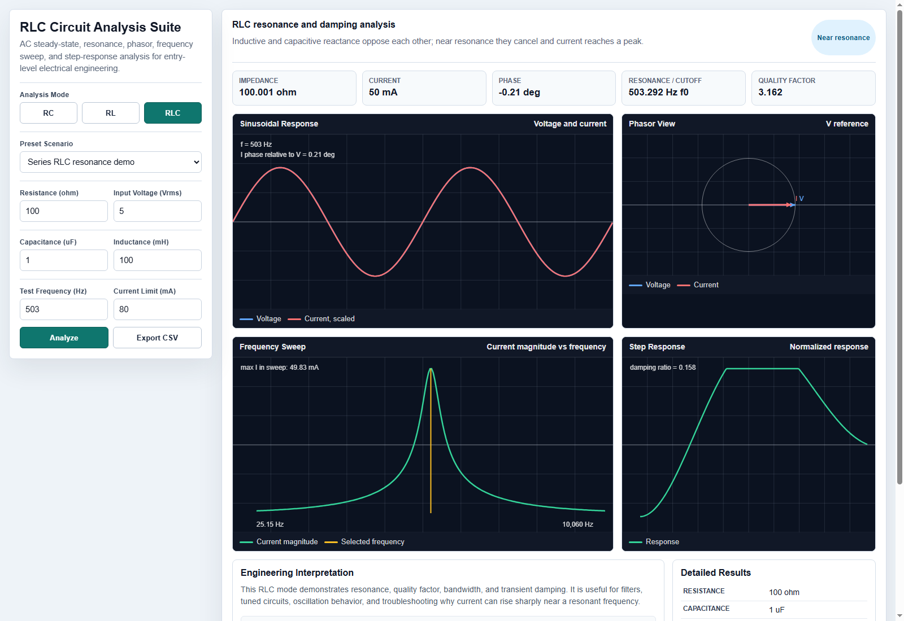

# RLC Circuit Analysis Suite

Status: **Advanced Version 1 complete**

## Purpose

This project is a portfolio-ready circuit analysis dashboard for RC, RL, and RLC circuits. It is designed to look and feel like an entry-level engineering tool rather than a basic calculator.

It demonstrates that I can connect circuit theory, formulas, visualization, testing, and documentation into one usable project.

## What It Does

- Analyzes RC, RL, and RLC series circuits
- Calculates impedance, reactance, current, phase angle, power factor, and real power
- Finds cutoff frequency for RC/RL circuits
- Finds resonant frequency, quality factor, bandwidth, and damping ratio for RLC circuits
- Draws voltage and current waveforms
- Draws a phasor diagram showing phase relationship
- Runs a frequency sweep to show current magnitude vs frequency
- Simulates a normalized step response
- Includes practical presets for filter, relay coil, resonance, and damping examples
- Exports calculated results to CSV
- Gives an engineering review warning when current exceeds a selected limit

## Why This Is Portfolio Worthy

This project is useful for entry-level electrical/electronics engineering because it shows more than a UI. It shows:

- Circuit theory understanding
- Mathematical modeling
- Frequency-domain reasoning
- Transient response reasoning
- Engineering interpretation
- Practical safety/current review
- Technical communication

## How To Run

Open `index.html` in a modern browser.

No installation, backend, internet connection, or paid tool is required.

## Preview



## Engineering Concepts Demonstrated

### RC Circuit

```text
Xc = 1 / (2*pi*f*C)
|Z| = sqrt(R^2 + Xc^2)
fc = 1 / (2*pi*R*C)
tau = R*C
```

### RL Circuit

```text
Xl = 2*pi*f*L
|Z| = sqrt(R^2 + Xl^2)
fc = R / (2*pi*L)
tau = L/R
```

### RLC Circuit

```text
X = Xl - Xc
|Z| = sqrt(R^2 + X^2)
f0 = 1 / (2*pi*sqrt(L*C))
Q = (1/R) * sqrt(L/C)
bandwidth = f0 / Q
```

## Test Scenario

Preset: **Series RLC resonance demo**

Inputs:

- R = 100 ohm
- L = 100 mH
- C = 1 uF
- V = 5 Vrms
- f = 503 Hz

Expected result:

- Resonant frequency is close to 503 Hz
- Net reactance is close to zero
- Phase angle is close to 0 degrees
- Current reaches a local maximum in the frequency sweep

## Entry-Level Job Value

This project supports applications for:

- Junior Electrical / Electronics Engineer
- Electronics Technician Trainee
- Lab Assistant
- Embedded Systems Intern
- Instrumentation Intern

It gives an interviewer something concrete to ask about: impedance, reactance, resonance, current limit, phase shift, frequency sweep, and transient behavior.

## Current Files

```text
RLC Circuit Analysis Suite/
|-- README.md
|-- index.html
|-- screenshot-v2.png
```

## Next Improvements

- Add selectable series vs parallel RLC mode
- Add component tolerance and Monte Carlo sweep
- Add CSV import for measured oscilloscope data
- Add screenshot examples for RC, RL, and RLC modes
- Add a short demo video for the portfolio
