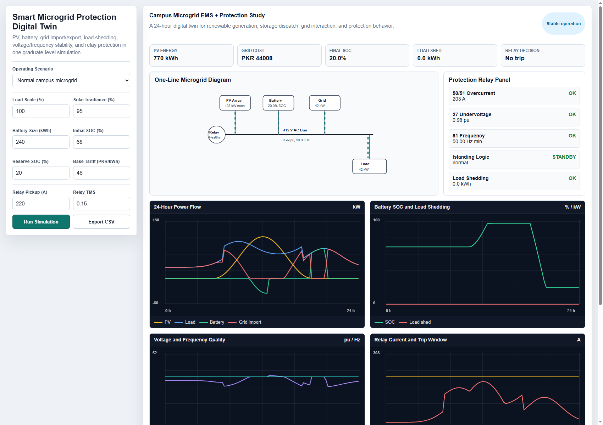

# Smart Microgrid Protection Digital Twin

Status: **Graduate-level portfolio project - Version 1 complete**

## Project Summary

This project is a browser-based digital twin for a campus-style smart microgrid. It combines renewable generation, battery energy storage, grid import/export, load shedding, voltage and frequency quality, and protection relay behavior into one interactive engineering dashboard.

The goal is to present a project that feels closer to a final-year electrical engineering project than a basic circuit exercise.

## Why This Project Is Strong

This is a system-level electrical engineering project. It does not only calculate one formula. It models a complete operating environment:

- PV generation changes through the day
- Load demand changes hour by hour
- Battery dispatch responds to shortage, surplus, peak tariff, and grid outage
- Grid import and export are calculated
- Bus voltage and frequency are estimated from system stress
- Protection relays respond to overcurrent, undervoltage, frequency violation, islanding, and load shedding
- Fault scenarios create realistic stress cases
- KPIs summarize energy, cost, reliability, and protection behavior

## Features

- 24-hour microgrid simulation at 15-minute resolution
- PV profile based on daylight and irradiance
- Battery state-of-charge model with reserve SOC
- Rule-based energy management system
- Time-of-use electricity cost estimate in PKR
- Grid outage and islanding simulation
- Line-to-ground, line-to-line, and three-phase fault scenarios
- IEC-style inverse-time overcurrent relay logic
- Undervoltage and frequency relay checks
- Load shedding calculation during shortage
- One-line microgrid diagram
- Power flow, SOC, voltage/frequency, and relay current charts
- CSV export for simulated results

## Engineering Concepts Demonstrated

### Energy Balance

```text
P_balance = PV + Battery_discharge + Grid_import - Load - Battery_charge - Shed
```

### Battery SOC Update

```text
SOC_next = SOC + (charge * eta - discharge / eta) * dt / Battery_capacity
```

### Three-Phase Current Approximation

```text
I = P / (sqrt(3) * V_LL * PF)
```

### IEC Inverse-Time Relay Approximation

```text
t = TMS * 0.14 / ((I / Ipickup)^0.02 - 1)
```

## Scenarios Included

| Scenario | What It Tests |
|---|---|
| Normal campus microgrid | Renewable support, peak shaving, healthy relay state |
| Cloudy day with PV intermittency | Storage response to renewable fluctuation |
| Evening grid outage / islanding | Battery backup and load shedding |
| Evening overload stress | Transformer/feeder current stress |
| Line-to-ground fault | Voltage sag and moderate fault current |
| Line-to-line fault | Severe unbalance and relay pickup |
| Three-phase bus fault | High fault current and fast trip behavior |

## Entry-Level and Graduate Value

This project supports applications for:

- Graduate trainee electrical engineer
- Power systems intern
- Renewable energy intern
- Smart grid / microgrid trainee
- Protection systems trainee
- Electrical design assistant
- Energy systems analyst trainee

It gives interviewers strong technical discussion points:

- How does battery dispatch reduce peak grid import?
- What causes load shedding during islanding?
- Why does a three-phase fault trip faster than an overload?
- How do voltage and frequency indicate system stress?
- Why is relay pickup different from a trip?
- What limitations exist in a simplified digital twin?

## How To Run

Open `index.html` in a modern browser.

No installation, backend, paid software, hardware, or internet connection is required.

## Preview



## Current Files

```text
Smart Microgrid Protection Digital Twin/
|-- README.md
|-- index.html
|-- screenshot-v1.png
```

## Limitations

This is an educational digital twin, not a certified power-system study tool. It uses simplified approximations for voltage, frequency, current, and relay response. Industrial-grade studies would require detailed network impedance, load flow, short-circuit analysis, relay coordination studies, equipment data, and validation against field measurements.

## Next Improvements

- Add single-line editable feeder parameters
- Add per-unit short-circuit calculation from source impedance
- Add relay coordination curve plot
- Add PV inverter reactive power support
- Add load priority classes for smarter load shedding
- Add comparison between rule-based EMS and optimized EMS
- Add measured-data import for validation
